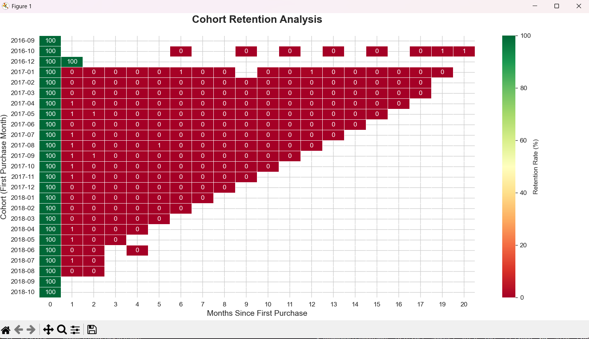
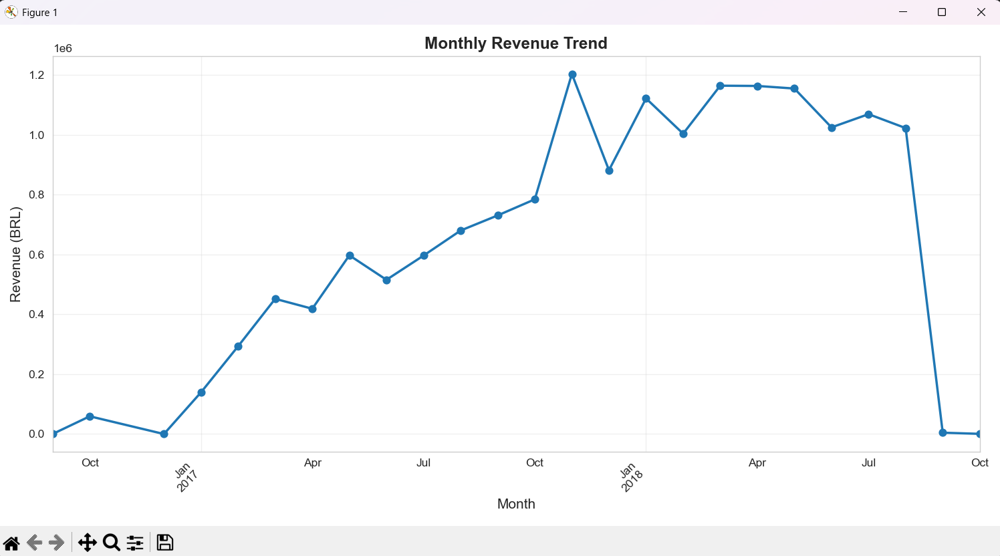
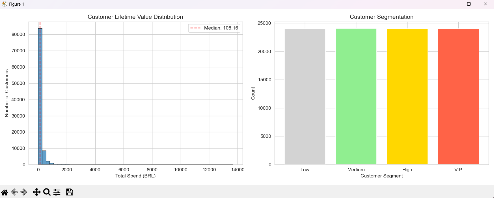
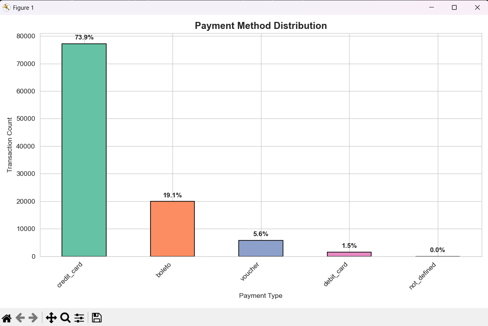
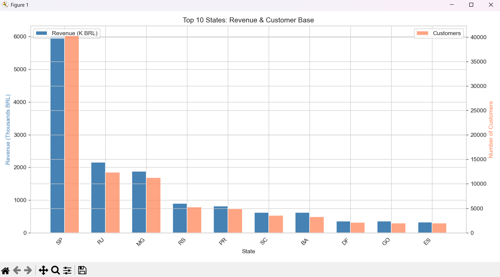
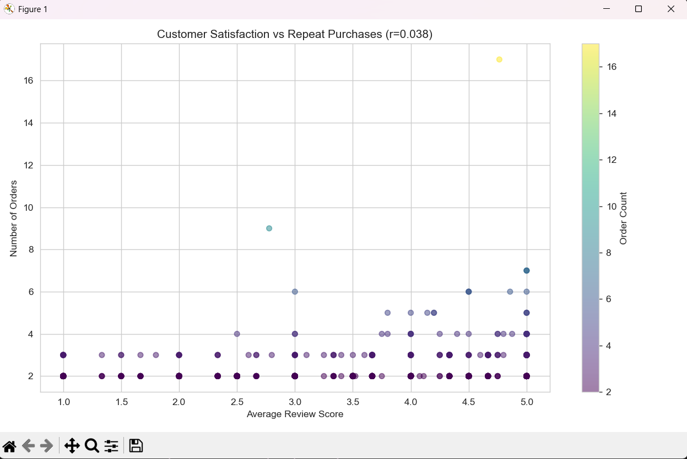
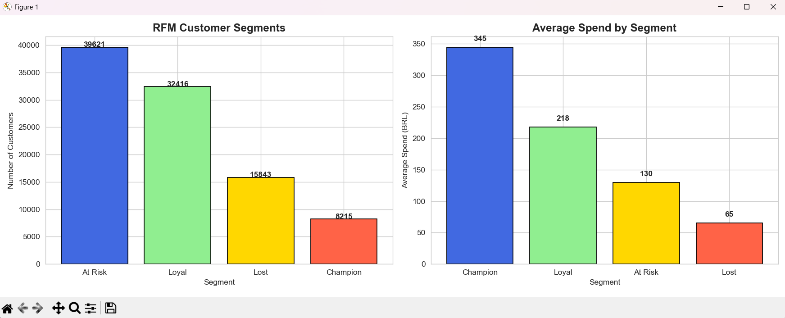

# Scalable E-Commerce Analytics Pipeline
> **A serverless AWS data pipeline and Python engine processing 100k+ records across 8 relational datasets to optimize Customer Lifetime Value (CLV) and Retention.**

---

### Business Impact & Strategy
This project transitions from local data processing to a **Cloud-Native Architecture**, simulating the scalability required in high-volume retail environments:

* **Retention Engineering:** Created a **Longitudinal Cohort Matrix** to identify exactly when customers "drop off," providing a quantitative baseline for automated re-engagement.
* **Predictive Segmentation:** Automated an **RFM (Recency, Frequency, Monetary) Model** to segment 90k+ unique identities, isolating a "Champion" group that generates **4x the average revenue**.
* **Cost-Optimized Scalability:** Architected a serverless Data Lake on **AWS**, decoupling storage from compute to enable high-velocity SQL querying with **near-zero infrastructure overhead**.

---

### Tech Used

**Cloud Infrastructure (AWS)**
* **Amazon S3:** Scalable object storage for the 8-table Data Lake.
* **AWS Glue:** Serverless ETL for data cataloging and schema discovery (Fixed `col0` header issues via Custom Classifiers).
* **Amazon Athena:** Interactive query service using ANSI SQL to analyze data directly in S3.

**Data Science & Programming**
* **Python:** Core language for data processing and statistical modeling.
* **Pandas & NumPy:** For complex relational joins across 8 datasets and mathematical correlations ($r=0.038$).
* **Matplotlib & Seaborn:** For generating high-resolution behavioral analytics and executive reports.

---

### Technical Implementation

**1. Cloud Data Engineering (AWS - Mumbai Region)**
* **Storage:** Established a centralized landing zone for 8 datasets (Orders, Payments, Customers, Reviews, etc.) ensuring 99.999999999% durability.
* **ETL Logic:** Orchestrated Glue Crawlers to automatically populate the **Glue Data Catalog**, creating a structured metadata layer for the raw CSVs.
* **Serverless SQL:** Optimized Athena queries for "Frugality" by using column projection to minimize data scanned per query.

**2. Analytics Pipeline (Python)**
* **Data Wrangling:** Executed multi-key joins across 8 sources to create a **Single Source of Truth**.
* **Modeling:** Developed custom logic for **Cohort Analysis** and **RFM Statistical Binning** using `pd.qcut`.

---

### Deep-Dive Visual Analytics

**1. Cohort Retention Analysis**
Tracked customers by their first purchase month to see exactly where the drop-off happens in Month 2, 3, and beyond.

**2. Revenue Growth Trajectory**
Analyzes monthly revenue over time to spot seasonal patterns or growth trends.

**3. Distribution of Customer Lifetime Value (CLV)**
Split customers into segments (Low, Medium, High, VIP) to identify which group drives the most revenue.

**4. Payment Infrastructure Analysis**
Identified that **73.9% of transactions are via Credit Card**, helping prioritize gateway stability.

**5. Regional Market Concentration**
Visualized how São Paulo and Rio dominate the marketplace and identified if smaller states "punch above their weight."

**6. Satisfaction vs. Loyalty Paradox**
A statistical analysis proving that **"Satisfied" does not always equal "Loyal."** Price often outweighs review scores for repeat purchases.

**7. RFM Behavioral Segmentation**
The final output of the pipeline, labeling customers as **Champions, Loyal, At Risk, or Lost**.

---

### What I Learned (Key Takeaways)
* **The Power of Cohorts:** Cohort analysis is significantly more useful than overall retention rates because it reveals which months produced the "stickiest" customers.
* **The Pareto Principle:** Confirmed that a small group of VIP/Champion customers contributes a disproportionate amount of total revenue.
* **RFM > Total Spend:** Scoring customers on **Recency** is eye-opening; a customer who bought recently for a small amount is often more valuable than someone who spent a lot two years ago.

---

### Future Roadmap
* **Automated ETL:** Use **AWS Lambda** triggers to run the Glue Crawler automatically when new data lands in S3.
* **Data Quality Gates:** Implement **AWS Glue Data Quality** to catch "dirty" data before it reaches the analytics layer.
* **Predictive ML:** Build a churn prediction model using **Amazon SageMaker** based on existing RFM segments.

---

### Repository Structure & Setup
1. **Cloud Workflow:** Upload `raw_data/` to S3 -> Run Glue Crawler -> Query via Athena SQL.
2. **Local Workflow:** * Download the [Olist Dataset from Kaggle](https://www.kaggle.com/datasets/olistbr/brazilian-ecommerce).
   * Place `orders`, `payments`, `customers`, and `reviews` CSVs in the project folder.
   * Install dependencies: `pip install pandas matplotlib seaborn numpy`.
   * Run: `python ecommerce_analysis.py`.

---
**Author:** Rithika Harikrishna  
[LinkedIn](https://linkedin.com/in/rithika-harikrishna) · [GitHub](https://github.com/rithikahaha)
